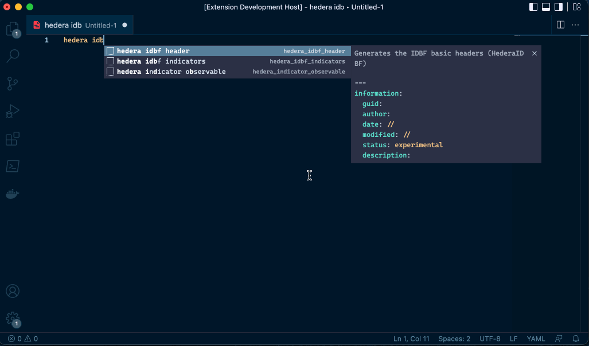

# hederaidbf README

Generates IDBF Hedera file with simplicity.

## Features

This plugin helps you to compose an IDBF (Indicator DataBase File) for Hedera; then, you can generate the idbf section using the intellisense.

## How to use

- Select `yaml` as document language;

- Start typing `hedera` and select the section that you want to generate.
## Release Notes

The below IDBF section are supported:

- hedera_idbf_header
- hedera_thehive_case_and_procedures
- hedera_idbf_indicators
- hedera_indicator_observable
- hedera_registry_value_exists
- hedera_file_exist
- hedera_file_hash
- hedera_file_yara
- hedera_pipe_exists
- hedera_process_exists
- hedera_process_hash
- hedera_process_yara 

### 0.0.1

First release

